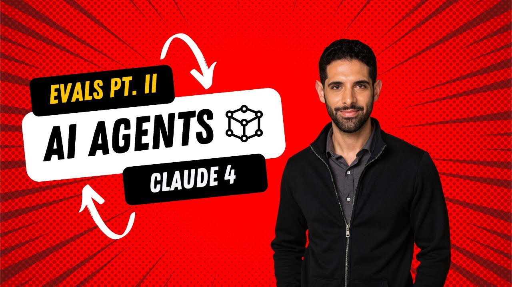
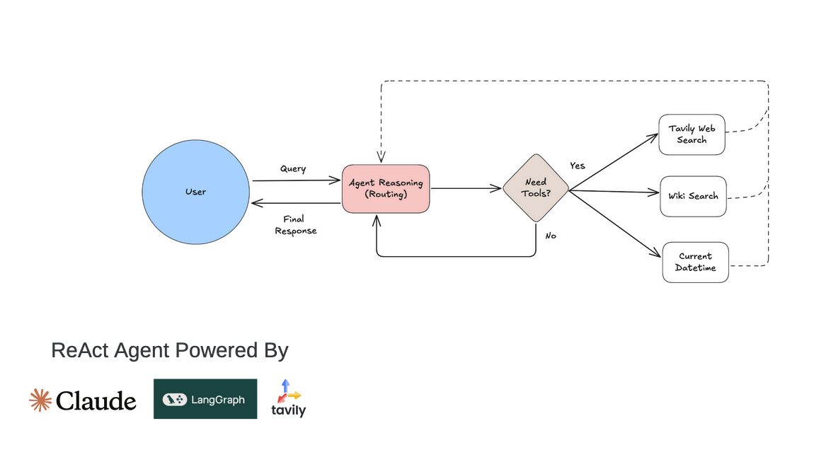

# 🦅🔥 Arize Phoenix + LangGraph Agent Evaluations

A comprehensive tutorial demonstrating how to build, trace, and evaluate a **ReAct agent** using **LangGraph**, **Claude**, and **Arize Phoenix**. This notebook walks through creating an agent with multiple tools and applying three different evaluation methodologies.

## 🎥 Demo

<p align="center">
  <a href="[https://www.youtube.com/watch?v=VIDEO_ID_HERE](https://www.youtube.com/watch?v=O07AV1CIXfo)">
    
  </a>
  <br>
  <em>▶️ Watch: AI Evals with Claude + LangGraph + Tavily Web Search + Arize Phoenix Pt. II 🦅🔥 — AI PM BY DESIGN</em>
</p>

---

## 📋 Overview

This notebook demonstrates an end-to-end workflow for:

1. **Building a ReAct Agent** with LangGraph and Claude (Anthropic)
2. **Instrumenting with OpenTelemetry** for full observability
3. **Evaluating agent performance** using Arize Phoenix's evaluation framework

---

## 🏗️ Architecture

<p align="center">
  
</p>

---

## 🔧 Tools Implemented

| Tool | Purpose | Use Case |
|------|---------|----------|
| **Tavily Search** | Web search for current information | Real-time news, current events, market data |
| **Wikipedia Search** | Knowledge base queries | Historical facts, definitions, biographies |
| **DateTime** | Current date/time awareness | Time-sensitive queries, scheduling context |

---

## 🧪 Evaluation Methods

### 1. Tool Calling Evaluation
Evaluates how well the agent:
- Selects the appropriate tool for a given query
- Extracts correct parameters from user input
- Generates valid tool call signatures

```python
# Uses TOOL_CALLING_PROMPT_TEMPLATE to classify tool calls as "correct" or "incorrect"
tool_call_evaluations = llm_classify(
    dataframe=spansDF,
    template=TOOL_CALLING_PROMPT_TEMPLATE,
    model=model,
    rails=rails,
    provide_explanation=True
)
```

### 2. Agent Path Convergence
Measures consistency in agent reasoning by:
- Running the agent on similar queries
- Recording the number of steps taken
- Calculating a convergence score (0-1, where 1 is perfect)

**Formula:** `convergence_score = avg(minimum_steps / actual_steps)`

The notebook demonstrates prompt optimization that improved average path length from **8.2 steps → 7.4 steps** (10% improvement).

### 3. Q&A on Retrieved Data
System-level evaluation checking whether:
- Questions are correctly answered based on retrieved context
- Answers are complete (not partial)
- Responses align with reference data

---

## 📦 Dependencies

```python
# Core Framework
langgraph
langchain-anthropic
langchain-community

# Tools
tavily-python
wikipedia

# Observability & Evaluation
phoenix
opentelemetry
openinference-instrumentation-langchain
openinference-instrumentation-anthropic

# Utilities
pandas
python-dotenv
nest_asyncio
pydantic
```

---

## ⚙️ Environment Setup

Create a `.env` file with the following API keys:

```bash
ANTHROPIC_API_KEY=your_anthropic_api_key
TAVILY_API_KEY=your_tavily_api_key
PHOENIX_API_KEY=your_phoenix_api_key  # If using hosted Phoenix
```

---

## 🚀 Quick Start

### 1. Install Dependencies
```bash
pip install langgraph langchain-anthropic langchain-community tavily-python wikipedia arize-phoenix opentelemetry-sdk openinference-instrumentation-langchain
```

### 2. Initialize Phoenix Tracer
```python
from phoenix.otel import register

tracer_provider = register(
    project_name="langgraph-anthropic-tavily-agent"
)
```

### 3. Create the Agent
```python
from langgraph.prebuilt import create_react_agent

agent = create_react_agent(
    model=claude,
    tools=available_tools,
    name="expert_sme",
    prompt=get_prompt(),
    checkpointer=MemorySaver()
)
```

### 4. Run Evaluations
```python
# Download spans from Phoenix
spansDF = px.Client().get_spans_dataframe(project_name='your-project')

# Run tool calling eval
tool_call_evaluations = llm_classify(
    dataframe=spansDF,
    template=TOOL_CALLING_PROMPT_TEMPLATE,
    model=model,
    rails=rails
)

# Log results back to Phoenix
px.Client().log_evaluations(
    SpanEvaluations(eval_name="Tool Calling Eval", dataframe=tool_call_evaluations)
)
```

---

## 📊 Key Results

### Tool Calling Accuracy
The agent successfully selects and parameterizes tools for queries like:
- Weather lookups → Tavily Search
- Historical facts → Wikipedia Search
- Time-sensitive queries → DateTime Tool

### Path Convergence Improvement
| Prompt Version | Avg Path Length | Convergence |
|----------------|-----------------|-------------|
| Original | 8.2 steps | Baseline |
| Optimized | 7.4 steps | **10% improvement** |

**Key optimization:** Adding explicit examples of good vs. bad responses in the prompt reduced unnecessary reasoning steps.

---

## 📁 Project Structure

```
├── Arize_Phoenix_LangGraph_Evals-v1.ipynb  # Main notebook
├── chris_nolan/
│   └── question_variations_analysis.csv    # Convergence test dataset
├── .env                                     # API keys (not committed)
└── README.md                               # This file
```

---

## 🔗 Resources

- [Arize Phoenix Documentation](https://arize.com/docs/phoenix/)
- [LangGraph Documentation](https://langchain-ai.github.io/langgraph/)
- [Tool Calling Eval Guide](https://arize.com/docs/phoenix/evaluation/how-to-evals/running-pre-tested-evals/tool-calling-eval)
- [Q&A Eval Guide](https://arize.com/docs/phoenix/evaluation/how-to-evals/running-pre-tested-evals/q-and-a-on-retrieved-data)

---

## 📝 Model Configuration

```python
MODEL = 'claude-3-7-sonnet-20250219'

claude = ChatAnthropic(
    model_name=MODEL,
    temperature=1,
    max_tokens=2000,
    thinking={"type": "enabled", "budget_tokens": 1024},
    extra_headers={
        "anthropic-beta": "interleaved-thinking-2025-05-14"
    }
)
```

---

## 🤝 Contributing

Feel free to open issues or submit PRs for:
- Additional evaluation templates
- New tool integrations
- Performance optimizations

---

## 📄 License

MIT License - See LICENSE file for details.
